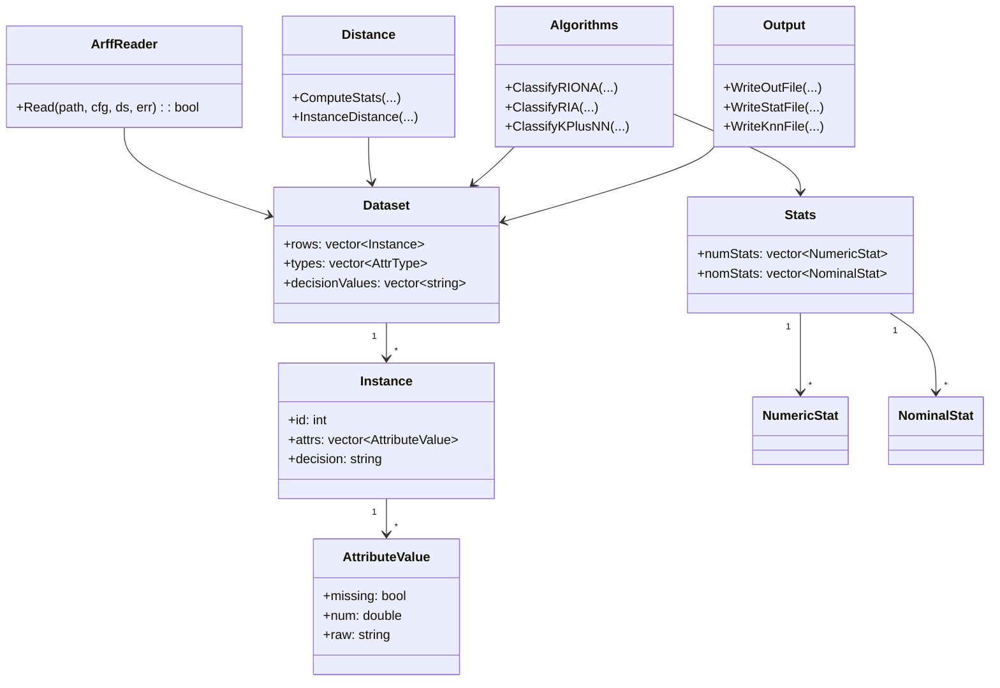

# RIONA (C++)

## Wymagania
- Dowolny system operacyjny (rozwiązanie testowane na Windows 11)
- Kompilator C++17
  - MSVC (Visual Studio 2019/2022, Build Tools), **lub**
  - LLVM Clang + narzędzia MSVC (uruchamiane z Developer Command Prompt)
- CMake >= 3.15 (opcjonalnie)

## Informacje
Projekt implementuje algorytmy klasyfikacji:
- **RIONA** (reguły + lokalne sąsiedztwo k‑NN),
- **RIA** (reguły),
- **k+NN** (k‑NN z lokalną metryką SVDM),

z obsługą **SVDM / SVDM'** dla atrybutów nominalnych i trybem **leave‑one‑out**.
Dane wejściowe są w formacie **ARFF**. Ostatni atrybut jest traktowany jako klasa.

Struktura projektu:
- `src/` – kod źródłowy (.cpp)
- `include/` – nagłówki (.h)
- `data/` – przykładowe zbiory ARFF

Wyniki każdego eksperymentu zapisywane są w osobnym folderze:
```
<outdir>/<nazwa_pliku_wejsciowego>/EXP_<suffix>/
```

## Uwagi
- Braki danych oznaczane są `?` (lub tokenem z `--missing`).
- Dla braków odległość wynosi:
  - nominalne: **2** (SVDM) lub **1** (SVDM'),
  - numeryczne: **1**.
- Dla atrybutów numerycznych odległość jest normalizowana przez zakres.
- Wagi SVDM przyjęte jako 1.0.

## Kompilacja
### Clang (LLVM) + MSVC toolchain
Uruchom w **x64 Native Tools Command Prompt for VS 2019**:
```
"C:\Program Files\LLVM\bin\clang++.exe" -std=c++17 -O2 -Wall -Wextra ^
  src\main.cpp src\util.cpp src\arff_reader.cpp src\distance.cpp src\algorithms.cpp src\metrics.cpp src\output.cpp ^
  -I include -o riona.exe
```

### CMake (MSVC)
```
cmake -S . -B build -G "Visual Studio 16 2019" -A x64
cmake --build build --config Release
```

## Korzystanie z programu
Podstawowe uruchomienie:
```
riona.exe --input data\heart-statlog.arff
```

Przykładowe parametry:
- `--algo riona|ria|knn|all`
- `--mode g|l|both`
- `--svdm svdm|svdmprime`
- `--k 1,3,log`
- `--n <int>` (dla k+NN)
- `--missing <token>`
- `--outdir <folder>`

Przykład pełny:
```
riona.exe --input data\yeast-mini.arff --algo all --mode both --svdm svdm --k 1,3,log --outdir results
```

## Diagram klas

